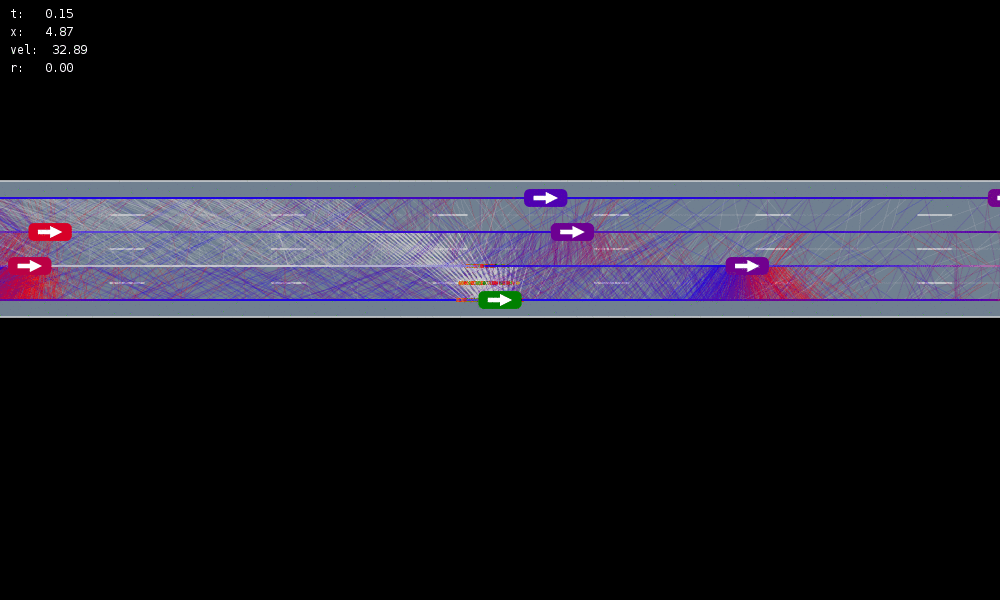

Our research focuses on artificial intelligence for controlling complex systems. We usually focus on autonomous aerospace systems, from space probes to drones to telescopes for tracking space debris, but we have also worked on other systems including ecological communities and autonomous cars. The theme that unites all of our research is **uncertainty**. This could be uncertainty in the system's parameters or states or in how other people, systems, or the environment will interact with it. We approach our research from many perspectives, ranging from pure mathematical theory to numerical simulation to hardware experiments. The mathematical formalisms that we most often use are the partially observable Markov decision process (POMDP) for stochastic uncertainty, or various game formalisms when the uncertainty is worst case or introduced by other rational agents. One of our most important specialties is developing online tree search algorithms for POMDPs, and we are one of the world's leading centers of development for this approach.

The best way to view our most up-to-date research is to look at our [Publications page](/publications). Some slides and brief descriptions of some of our projects can be found below. (If you cannot see the slides, make sure to disable all add blockers.)

<iframe src="https://adcl.slides.com/zacharysunberg/adcl-summary/embed?style=light" width="100%" style="aspect-ratio:16/9" allowfullscreen title="ADCL Summary"></iframe>

## Applications and Extensions

### Search and Rescue

Autonomous aircraft have the potential to vastly improve our ability to undertake remote sensing tasks such as search and rescue and wildfire monitoring. However, autonomous systems may not have the contextual knowledge that human expert operators have. We're partnering with the [COHRINT Lab]( https://cohrint.info/) to integrate our intelligent [POMDP planners](#practical-pomdp-algorithms) with input from an operator to improve search and rescue.

<iframe width="560" height="315" src="https://www.youtube.com/embed/d582HlUscaM?si=YrakeZ17ngKJDaHy" title="YouTube video player" frameborder="0" allow="accelerometer; autoplay; clipboard-write; encrypted-media; gyroscope; picture-in-picture; web-share" allowfullscreen></iframe>

### Ecological Navigation

Ecological management problems often involve navigating from an initial to a desired community state. We showed that navigation between states is an equivalent problem to searching for lowest-cost sequences of actions that comprise direct and shortcut paths. Shortcuts can be obtained by using small sequential abundance perturbations (e.g. low-density introductions) and environment perturbations to nudge communities between states. Our work suggests that brute-force approaches to navigation like antibiotics or clearcutting may have realistic and less impactful alternatives.

- [Navigation between initial and desired community states using shortcuts](https://arxiv.org/abs/2204.07629), Blonder et al. (2023), In _Ecology Letters_.

### Behavior-Aware Autonomous Driving

In autonomous driving, there is an inherent tradeoff between safety and efficiency, especially time-efficiency.
If a self-driving car is to be perfectly safe, it cannot enter the road, and it can be the fastest if there are no safety constraints.
This tradeoff results in the Pareto curves shown in the figure below.
But the performance also depends on the model.
We showed that by modeling the latent internal states of the other drivers on the road, safety and efficiency can both be *simultaneously* improved (this corresponds to moving the Pareto curve).
In computational tests in a highway driving scenario, internal state modeling allowed the autonomous vehicle to perform a multiple-lane change maneuver nearly twice as fast with the same level of safety.

<video autoplay="autoplay" loop="loop" width="100%" controls>
  <source src="/assets/videos/highway_planning.mp4" type="video/mp4">
  <source src="/assets/videos/highway_planning.webm" type="video/webm">
  <source src="/assets/videos/highway_planning.ogv" type="video/ogg">
  
</video>

- [Improving Automated Driving through POMDP Planning with Human Internal States](https://arxiv.org/abs/2005.14549), Sunberg and Kochenderfer (2022), In _IEEE Transactions on Intelligent Transportation Systems_.
- [The Value of Inferring the Internal State of Traffic Participants for Autonomous Freeway Driving](https://arxiv.org/abs/1702.00858), Sunberg et al. (2017), Pre-print.

### Autonomous Autorotation

In 2013, Professor Sunberg (as an MS student) and collaborators used autorotation to repeatedly successfully land a small autonomous helicopter without power.
The video below contains footage of one of the landings from a nose-mounted camera.
Note that the pilot releases control as he turns off the motor.

<iframe width="560" height="315" src="https://www.youtube.com/embed/mAFeDq9ZdH4" frameborder="0" allow="autoplay; encrypted-media" allowfullscreen></iframe>

- [A Real-Time Expert Control System For Helicopter Autorotation](http://www.ingentaconnect.com/content/ahs/jahs/2015/00000060/00000002/art00008), Sunberg et al. (2015), In _Journal of the American Helicopter Society_.

## Theoretical Foundations
### Optimality of POMDP Approximations

Partially observable Markov decision processes (POMDPs) provide a flexible representation for real-world decision and control problems. However, POMDPs are notoriously difficult to solve, especially when the state and observation spaces are continuous or hybrid, which is often the case for physical systems. We present a general theory characterizing the approximation error of the practically effective particle filtering techniques that many recent online sampling-based POMDP algorithms use.

- [Optimality Guarantees for Particle Belief Approximation of POMDPs](https://jair.org/index.php/jair/article/view/14525), Lim et al. (2023), Journal of Artificial Intelligence Research (JAIR).

### POMDP Algorithms with Theoretical Guarantees
<!--  -->

Recent online sampling-based algorithms that use techniques such as observation likelihood weighting and have shown unprecedented effectiveness in domains with continuous observation and action spaces. This line of work offers theoretical justifications of these techniques, proving that our new algorithms that utilize these techniques will estimate Q-values accurately with high probability and can be made to perform arbitrarily near the optimal solution by increasing computational power.

- [Voronoi Progressive Widening: Efficient Online Solvers for Continuous State, Action, and Observation POMDPs](https://ieeexplore.ieee.org/abstract/document/9683490), Lim et al. (2021), In the proceedings of _IEEE Conference on Decision and Control (CDC)_.
- [Sparse tree search optimality guarantees in POMDPs with continuous observation spaces](https://arxiv.org/abs/1910.04332), Lim et al. (2020), In the proceedings of _International Joint Conferences on Artificial Intelligence (IJCAI)_.

## Algorithmic Developments

### Practical POMDP algorithms

Leading online partially observable Markov decision process (POMDP) solvers such as POMCP and DESPOT can handle continuous state spaces, but they still struggle with continuous action and observation spaces.
In fact, it can be shown analytically that they will converge to suboptimal solutions for some POMDPs with continuous action spaces regardless of the amount of computation.
In this line of work, we propose novel POMDP algorithms that overcome these problems using techniques such as progressive widening and weighted particle filtering. 

For example, in the light-dark example above, POMCP (left) cannot decide to localize in the light region, while our new algorithm **POMCPOW** (right) can, allowing it to hit the target at the origin much more quickly.

- [Voronoi Progressive Widening: Efficient Online Solvers for Continuous State, Action, and Observation POMDPs](https://ieeexplore.ieee.org/abstract/document/9683490), Lim et al. (2021), In the proceedings of _IEEE Conference on Decision and Control (CDC)_.
- [Online algorithms for POMDPs with continuous state, action, and observation spaces](https://arxiv.org/abs/1709.06196), Sunberg and Kochenderfer (2018), In the proceedings of _International Conference on Automated Planning and Scheduling (ICAPS)_.

